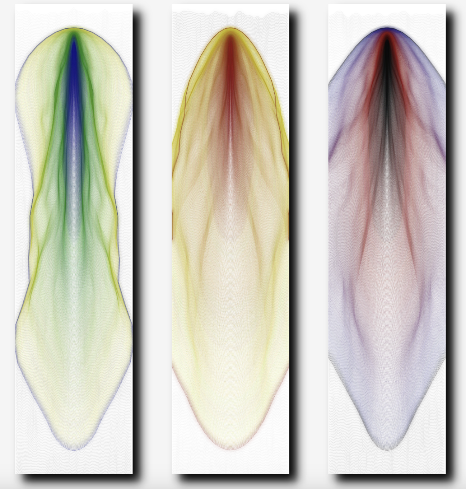

# Week9 quiz

## Part 1: Imaging Technique Inspiration

The artwork our group chose is ‘Ntange II (Grass)’ by Emily Kame Kngwarreye. The direction of our group is to combine point, line and surface elements with natural elements. Based on this direction, I will collect inspiration as follows.

  
  

I am greatly inspired by the artworks of [Emma Larsso](https://www.hugoandmarie.com/artists/emma-larsson/). Her works present the natural growth of organisms in nature from a microscopic perspective. I got two inspirations from it:

- In terms of composition, large areas of color blocks can be decorated with random or regular points, lines and surfaces to make the picture more vivid.  
- In terms of technique, the ink smudging material makes the picture more layered and more natural. In the next part, I will discuss how to achieve this technique.

## Part 2: Coding Technique Exploration

To achieve the effect of ink smudging, first use `lerpColor()` to generate a gradient color for the color transition between the center and the edge when smudging. Then use `noise()` with `curveVertex()` to draw the flow range of the ink smudging curve, and finally use the `filter(BLUR)` function to simulate the blurred transition of ink seeping on paper, thereby achieve the process of ink smudging from the center to the outside.

### The Coding Technique in Action

  
[Source](https://openprocessing.org/sketch/2613929)

### Related Functions

- [`lerpColor()`](https://p5js.org/reference/p5/lerpColor/)  
- [`noise()`](https://p5js.org/reference/p5/noise/)  
- [`curveVertex()`](https://p5js.org/reference/p5/curveVertex/)  
- [`filter(BLUR)`](https://p5js.org/reference/p5/filter/)